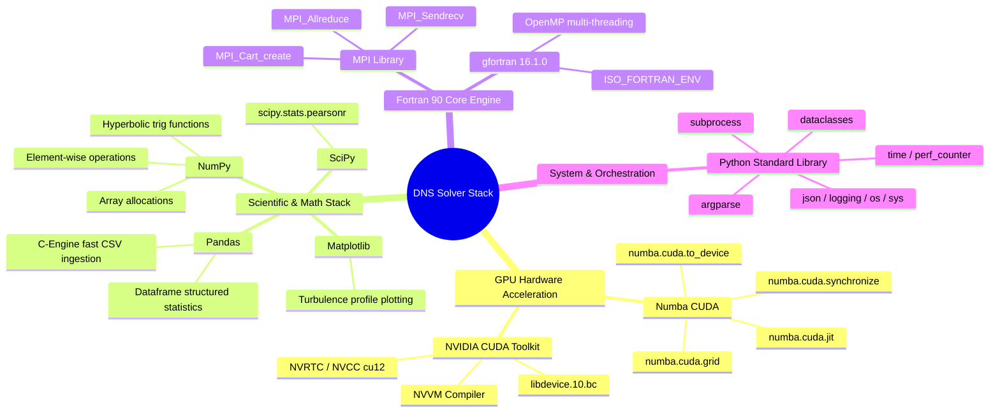

# 📚 Dependencies & Libraries Audit

This document provides a comprehensive library audit, taxonomic mindmap, specification matrix, and function-level mapping for all dependencies used across the **3D Compressible Turbulent Channel Flow DNS Solver**.

---

## 📌 1. Taxonomic Mindmap of Project Dependencies

---

## 📌 2. Library Specification Matrix

| Library / Module | Import / Include Statement | Category | Open Source License | Core Responsibilities |
| :--- | :--- | :--- | :--- | :--- |
| **Numba CUDA** | `from numba import cuda, float64, int32` | GPU Acceleration | BSD 2-Clause | Compiles Python device functions into native NVIDIA PTX assembly for GPU execution. |
| **NumPy** | `import numpy as np` | Array Computing | BSD 3-Clause | Host RAM allocation, vector array slicing, multidimensional matrix transformations. |
| **Pandas** | `import pandas as pd` | Data Ingestion | BSD 3-Clause | High-speed C-engine parsing (`engine='c'`) for 500+ MB whitespace/CSV initial condition files. |
| **SciPy** | `from scipy.stats import pearsonr` | Statistics | BSD 3-Clause | Calculates Pearson correlation coefficient $r$ between Fortran and CUDA solution fields. |
| **Matplotlib** | `import matplotlib.pyplot as plt` | Visualization | PSF / BSD | Generates 1D mean velocity $\bar{u}(z)$ and RMS fluctuation profile comparison plots. |
| **Python Argparse** | `import argparse` | Standard Library | Python (PSFL) | CLI parameter parsing (`--input`, `--steps`, `--output`, `--demo`). |
| **Python Dataclasses**| `from dataclasses import dataclass` | Standard Library | Python (PSFL) | Strongly-typed simulation parameter structures (`GridConfig`, `FlowConfig`). |
| **Python Subprocess** | `import subprocess` | Standard Library | Python (PSFL) | Invokes native GFortran compiler and binary execution from Python runner scripts. |
| **Python Time** | `import time` | Standard Library | Python (PSFL) | Microsecond-accurate wall-clock timer (`time.perf_counter`) for dynamic benchmarks. |
| **Python JSON** | `import json` | Standard Library | Python (PSFL) | Exports structured summary benchmark reports and error norm metrics. |
| **GFortran 16.1.0** | `gfortran -O3 -fopenmp` | Compiler / Toolchain | GNU GPL v3 | Compiles Fortran 90 source modules into native machine code with OpenMP parallel loops. |
| **MPI (mpich/openmpi)**| `use mpi` / `include 'mpif.h'` | Parallel Computing | BSD / MIT | 3D Cartesian domain decomposition and halo boundary communication (`MPI_Sendrecv`). |
| **Fortran ISO Module** | `use ISO_FORTRAN_ENV` | Standard Module | Standard ISO/IEC | Explicit 64-bit real precision specification (`real(kind=REAL64)`). |

---

## 📌 3. Exhaustive File-by-File & Function-by-Function Location Map

### 3.1 Python Scientific & CUDA Libraries

| Library | Function / Symbol | Target File Location | Function / Purpose |
| :--- | :--- | :--- | :--- |
| `numba.cuda` | `@cuda.jit(device=True)` | [`cuda code.py`](file:///c:/Users/Amber/Downloads/uc_Re3k_Ma15/cuda%20code.py#L200-L350) | Inlined GPU device stencil functions (derivative operators). |
| `numba.cuda` | `@cuda.jit` | [`cuda code.py`](file:///c:/Users/Amber/Downloads/uc_Re3k_Ma15/cuda%20code.py#L400-L800) | Global GPU kernel functions (`compute_convective_kernel`, `compute_viscous_kernel`, `update_rk2_kernel`). |
| `numba.cuda` | `cuda.grid(3)` | [`cuda code.py`](file:///c:/Users/Amber/Downloads/uc_Re3k_Ma15/cuda%20code.py#L412) | Computes global 3D thread index `(i, j, k)` across CUDA block grid. |
| `numba.cuda` | `cuda.to_device(...)` | [`cuda code.py`](file:///c:/Users/Amber/Downloads/uc_Re3k_Ma15/cuda%20code.py#L950) | Allocates VRAM and transfers host NumPy arrays to GPU memory. |
| `numba.cuda` | `cuda.synchronize()` | [`cuda code.py`](file:///c:/Users/Amber/Downloads/uc_Re3k_Ma15/cuda%20code.py#L1020) | Enforces execution barrier between RK2 sub-steps. |
| `numpy` | `np.zeros(...)` | [`cuda code.py`](file:///c:/Users/Amber/Downloads/uc_Re3k_Ma15/cuda%20code.py#L920), [`python/process_input_files.py`](file:///c:/Users/Amber/Downloads/uc_Re3k_Ma15/python/process_input_files.py#L120) | Allocates zero-initialized host state arrays. |
| `numpy` | `np.tanh(...)`, `np.linspace(...)` | [`cuda code.py`](file:///c:/Users/Amber/Downloads/uc_Re3k_Ma15/cuda%20code.py#L880) | Generates non-uniform wall-normal hyperbolic tangent mesh coordinates. |
| `numpy` | `np.trapz(...)` | [`python/process_input_files.py`](file:///c:/Users/Amber/Downloads/uc_Re3k_Ma15/python/process_input_files.py#L180) | Trapezoidal integration for bulk density $\rho_b$ and bulk velocity $U_b$. |
| `numpy` | `np.mean(...)`, `np.std(...)` | [`python/process_input_files.py`](file:///c:/Users/Amber/Downloads/uc_Re3k_Ma15/python/process_input_files.py#L210), [`python/compare_fortran_cuda.py`](file:///c:/Users/Amber/Downloads/uc_Re3k_Ma15/python/compare_fortran_cuda.py#L150) | Calculates mean flow field values and standard deviations. |
| `pandas` | `pd.read_csv(..., engine='c')` | [`cuda code.py`](file:///c:/Users/Amber/Downloads/uc_Re3k_Ma15/cuda%20code.py#L850), [`python/process_input_files.py`](file:///c:/Users/Amber/Downloads/uc_Re3k_Ma15/python/process_input_files.py#L95) | Fast C-engine ASCII dataset parser. |
| `scipy.stats` | `pearsonr(arr1, arr2)` | [`python/compare_fortran_cuda.py`](file:///c:/Users/Amber/Downloads/uc_Re3k_Ma15/python/compare_fortran_cuda.py#L175) | Computes Pearson correlation coefficient $r$ for physical variable verification. |
| `subprocess` | `subprocess.run(...)` | [`python/recompile_and_run_fortran.py`](file:///c:/Users/Amber/Downloads/uc_Re3k_Ma15/python/recompile_and_run_fortran.py#L80), [`python/benchmark_solvers.py`](file:///c:/Users/Amber/Downloads/uc_Re3k_Ma15/python/benchmark_solvers.py#L90) | Executes `gfortran` compilation commands and runs Fortran executable binaries. |
| `time` | `time.perf_counter()` | [`python/benchmark_solvers.py`](file:///c:/Users/Amber/Downloads/uc_Re3k_Ma15/python/benchmark_solvers.py#L110), [`python/compare_processing_times.py`](file:///c:/Users/Amber/Downloads/uc_Re3k_Ma15/python/compare_processing_times.py#L85) | Measures microsecond-resolution execution wall-clock timing. |

---

### 3.2 Fortran 90 & System Libraries

| Library / Header | Function / Directive | Target File Location | Function / Purpose |
| :--- | :--- | :--- | :--- |
| `mpi` / `mpif.h` | `MPI_Init(...)`, `MPI_Cart_create(...)` | [`codes1/mod_my_mpi.f90`](file:///c:/Users/Amber/Downloads/uc_Re3k_Ma15/codes1/mod_my_mpi.f90#L30-L70) | Initializes MPI environment and sets up 3D Cartesian rank topology. |
| `mpi` / `mpif.h` | `MPI_Sendrecv(...)` | [`codes1/mod_my_mpi.f90`](file:///c:/Users/Amber/Downloads/uc_Re3k_Ma15/codes1/mod_my_mpi.f90#L110-L160) | Exchanges boundary halo planes between adjacent 3D domain processors. |
| `mpi` / `mpif.h` | `MPI_Allreduce(...)` | [`codes1/mod_my_mpi.f90`](file:///c:/Users/Amber/Downloads/uc_Re3k_Ma15/codes1/mod_my_mpi.f90#L180) | Performs global sum reductions for physical diagnostics. |
| `omp_lib` | `#pragma omp parallel for` / `!$omp` | [`codes1/main_v2.0_08_oc+v_st_3.f90`](file:///c:/Users/Amber/Downloads/uc_Re3k_Ma15/codes1/main_v2.0_08_oc+v_st_3.f90#L45) | Parallelizes CPU loop iterations across available thread cores. |
| `ISO_FORTRAN_ENV` | `REAL64`, `INT32` | [`codes1/mod_comdata.f90`](file:///c:/Users/Amber/Downloads/uc_Re3k_Ma15/codes1/mod_comdata.f90#L15) | Guarantees strict 64-bit IEEE 754 float precision across compilers. |
