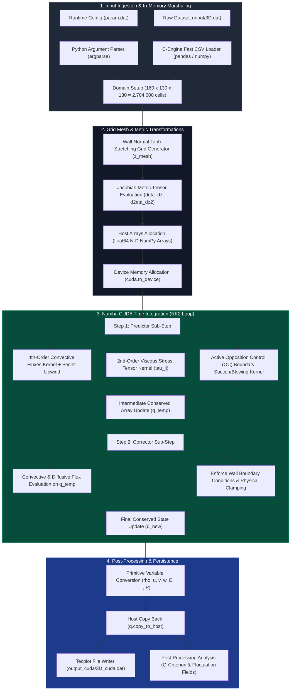
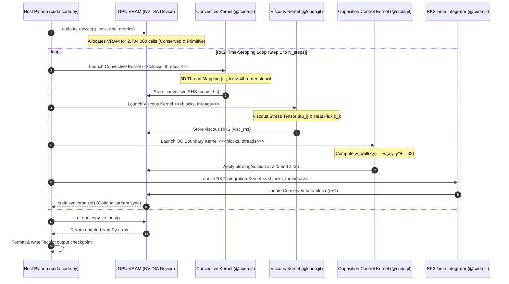

# 🔄 Project Flow & Architectural Lifecycle

This document describes the high-level system architecture, numerical execution flow, dynamic thread grid lifecycle, and explicit library annotations for the **3D Compressible Turbulent Channel Flow DNS Solver**.

---

## 📌 1. High-Level Architectural Data Flowchart

The overall computational execution flow of the solver—from raw parameter loading to final Tecplot visualization—is illustrated in the Mermaid flowchart below:

---

## 📌 2. CUDA Thread Grid Execution Sequence Diagram

The interaction between the Python host controller and the NVIDIA GPU device kernels during a single RK2 time-step is detailed in the sequence diagram below:

---

## 📌 3. Detailed 5-Step Data Lifecycle

### Step 1: Input Ingestion & Type Marshaling
- **Input Parameters**: Configured via command line arguments (`argparse`) or [`param.dat`](file:///c:/Users/Amber/Downloads/uc_Re3k_Ma15/param.dat) file. Parameters include Reynolds number ($\text{Re}=3000$), Mach number ($\text{Ma}=1.5$), time step ($\Delta t = 1.0\times 10^{-4}$), and Peclet upwind limits ($\text{Pe}_x=2.0, \text{Pe}_y=1.0, \text{Pe}_z=0.1$).
- **Data Loading**: High-speed C-engine Pandas loader (`pandas.read_csv(..., engine='c')`) reads 3D initial condition datasets ([`input/3D.dat`](file:///c:/Users/Amber/Downloads/uc_Re3k_Ma15/input/3D.dat)) containing 2,704,000 grid points ($160 \times 130 \times 130$).

### Step 2: Mesh & Metric Transformations
- **Wall-Normal Tanh Stretching**: Mesh coordinates in $z \in [0, 2]$ are non-uniformly clustered near upper and lower walls using a hyperbolic tangent mapping function:
  $$z(\eta) = 1 + \frac{1}{a} \tanh\left[ \eta \cdot \text{atanh}(a) \right], \quad \eta \in [-1, 1]$$
- **Jacobian Metrics**: Metrics $\mathcal{J} = \frac{d\eta}{dz}$ and higher-order derivative metric factors ($\frac{d^2\eta}{dz^2}$) are precalculated in 1D memory vectors on host CPU and pushed to GPU device memory (`cuda.to_device`).

### Step 3: Convective & Diffusive Flux Stencils (GPU Execution)
- **Convective Terms**: Evaluated on GPU threads using a 4th-order central finite difference scheme:
  $$\left( \frac{\partial F}{\partial x} \right)_{i,j,k} = \frac{-F_{i+2,j,k} + 8F_{i+1,j,k} - 8F_{i-1,j,k} + F_{i-2,j,k}}{12 \Delta x}$$
  Adaptive Peclet-based upwinding is triggered when local grid Peclet number exceeds $\text{Pe}_{\text{limit}}$.
- **Viscous Terms**: Computed using 2nd-order central differences to assemble the full 3D compressible viscous stress tensor:
  $$\tau_{ij} = \mu \left( \frac{\partial u_i}{\partial x_j} + \frac{\partial u_j}{\partial x_i} - \frac{2}{3} \delta_{ij} \frac{\partial u_k}{\partial x_k} \right)$$

### Step 4: Active Opposition Control ($\text{OC}$) & Boundary Conditions
- **Blowing / Suction Control**: Sensor plane velocity $w(x, y, y^+ = 33)$ at target wall distance ($k=16$) is extracted. Opposite velocity is imposed at the lower wall ($z=0$) and upper wall ($z=2h$):
  $$w_{\text{wall}}(x,y) = -w(x, y, y^+ = 33)$$
- **Physical Boundary Clamping**: No-slip isothermal/adiabatic conditions applied at walls ($u=v=0$). Periodic boundary conditions in $x$ and $y$ directions are enforced inside GPU thread blocks using modular arithmetic:
  $$i_{\text{prev}} = (i - 1 + N_x) \pmod{N_x}, \quad i_{\text{next}} = (i + 1) \pmod{N_x}$$

### Step 5: Post-Processing & Persistence
- **Tecplot Checkpointing**: Conserved fields are copied back to host RAM via `q_device.copy_to_host()` and written to Tecplot ASCII format (`output_cuda/3D_cuda.dat`).
- **Turbulence Statistics**: Post-processing analysis routines compute the Vortex $Q$-Criterion:
  $$Q = \frac{1}{2} \left( \|\mathbf{\Omega}\|^2 - \|\mathbf{S}\|^2 \right)$$
  and root-mean-square (RMS) velocity fluctuation fields ($u', v', w'$).

---

## 📌 4. Explicit Library & Header Annotations

| Lifecycle Phase | Component / Module | Driving Library / Header | Responsibility |
| :--- | :--- | :--- | :--- |
| **Ingestion** | Argument Parser | Python `argparse` | Parses CLI flags (`--steps`, `--input`, `--output`, `--demo`). |
| **Ingestion** | Dataset Loader | `pandas` (C-Engine) / `numpy` | Fast array allocation and multi-gigabyte CSV/ASCII ingestion. |
| **Initialization** | Device Memory Allocation | `numba.cuda` | Transfers array buffers from Host RAM to VRAM (`cuda.to_device`). |
| **Initialization** | Grid Generation | `numpy` (`np.tanh`, `np.linspace`) | Calculates 1D non-uniform mesh and metric Jacobian arrays. |
| **Numerics** | CUDA JIT Compilation | `numba` (`@cuda.jit(device=True)`) | Compiles Python device functions into native NVIDIA PTX machine code. |
| **Numerics** | Thread Grid Indexing | `numba.cuda` (`cuda.grid(3)`) | Maps CUDA block/thread indices `(tx, ty, tz)` to 3D mesh indices `(i, j, k)`. |
| **Numerics** | Device Math Functions | Python `math` / `numba.cuda.math` | Accelerated hardware scalar math functions (`math.sqrt`, `math.exp`). |
| **Fortran Solver** | Domain Decomposition | Fortran 90 `mpi` module | 3D Cartesian process distribution and halo exchange (`MPI_Sendrecv`). |
| **Fortran Solver** | OpenMP Multi-Threading | `omp_lib` / `OMP_NUM_THREADS` | Multi-core CPU loop parallelization (`#pragma omp parallel`). |
| **Persistence** | Tecplot Data Output | Python `sys` / `builtins.open` | Formatted multi-column Tecplot ASCII solution export. |
| **Analysis** | Statistical Metrics | `scipy.stats` (`pearsonr`) | Quantitative field correlation between Fortran MPI and CUDA GPU outputs. |
